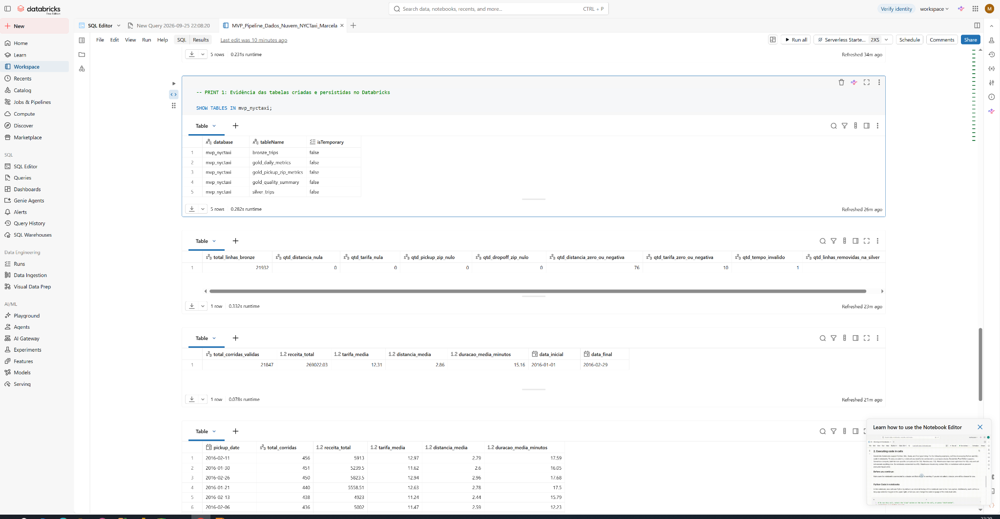
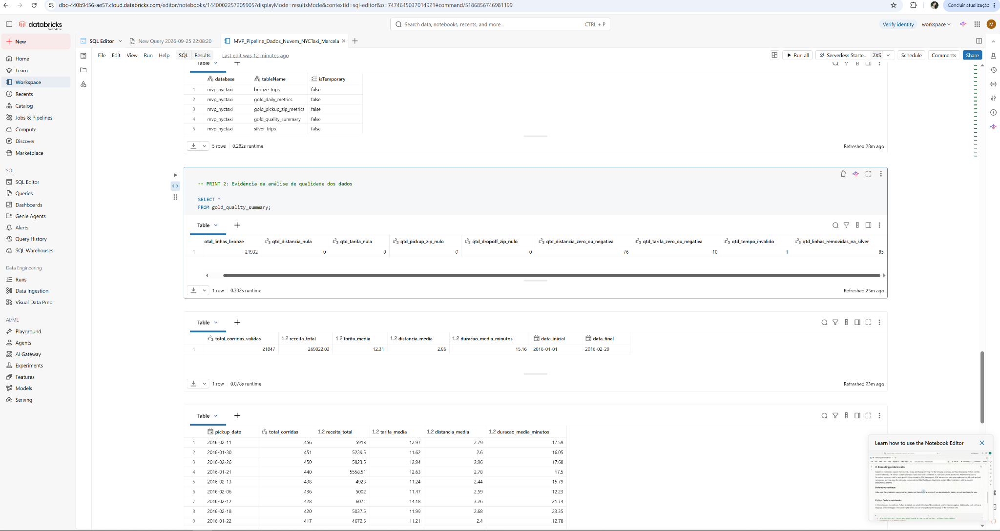
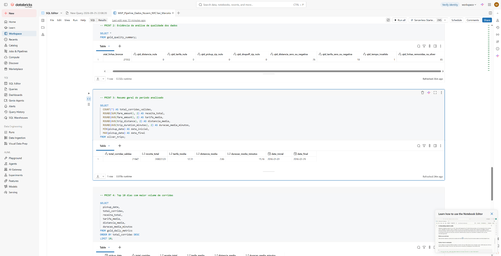
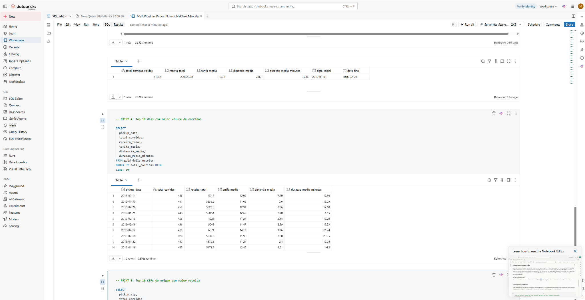
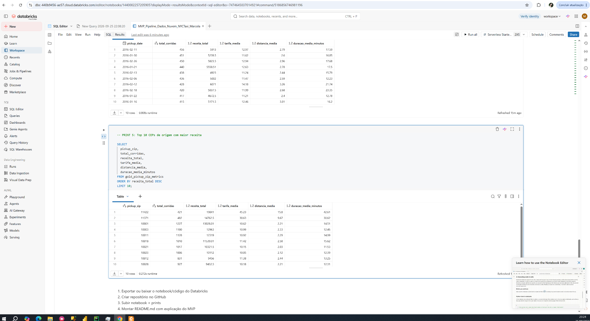

# MVP - Pipeline de Dados na Nuvem com Databricks

## 1. Contexto de Negócio e Perguntas

Este projeto foi desenvolvido como MVP da disciplina de Engenharia de Dados / Pipeline de Dados na Nuvem.

O objetivo foi construir um pipeline de dados funcional em ambiente de nuvem, utilizando o Databricks Free Edition, a partir de uma base pública de corridas de táxi de Nova York.

O problema de negócio considerado foi:

> Uma empresa de mobilidade deseja organizar dados brutos de corridas de táxi para analisar volume de viagens, receita, distância média, duração média e possíveis problemas de qualidade nos registros.

As perguntas de negócio definidas foram:

1. Qual é o volume total de corridas válidas no período analisado?
2. Quais dias tiveram maior quantidade de corridas?
3. Quais dias tiveram maior receita?
4. Quais CEPs de origem geraram maior receita?
5. Existem problemas de qualidade nos dados brutos? Se sim, como foram tratados?

## 2. Fonte, Licença e Coleta dos Dados

A base utilizada foi a tabela pública:

`samples.nyctaxi.trips`

Essa base está disponível dentro do próprio ambiente Databricks e contém dados de corridas de táxi de Nova York.

A escolha dessa base foi feita porque ela possui estrutura adequada para demonstrar um pipeline de dados na nuvem, com campos de data/hora, valores numéricos, localização de origem/destino e possibilidade de análise de qualidade dos dados.

Principais campos utilizados:

| Campo | Descrição |
|---|---|
| `tpep_pickup_datetime` | Data e hora de início da corrida |
| `tpep_dropoff_datetime` | Data e hora de fim da corrida |
| `trip_distance` | Distância da corrida |
| `fare_amount` | Valor da tarifa |
| `pickup_zip` | CEP de origem |
| `dropoff_zip` | CEP de destino |

A coleta foi realizada diretamente no Databricks, usando SQL, a partir da base pública `samples.nyctaxi.trips`.

Quanto à licença/uso dos dados, a base foi utilizada exclusivamente para fins acadêmicos e didáticos, por estar disponível como dataset público de exemplo no próprio ambiente Databricks. Os dados brutos não foram redistribuídos neste repositório.

Não foi necessário disponibilizar os dados brutos no GitHub, pois a base utilizada já está disponível no ambiente Databricks. O repositório contém o notebook com o código SQL utilizado, a documentação do projeto e as evidências de execução.

## 3. Plataforma e Carga dos Dados

A implementação foi realizada no:

- Databricks Free Edition
- Linguagem SQL
- Notebook Databricks exportado em formato `.ipynb`

Arquivo principal do projeto:

[`MVP_Pipeline_Dados_Nuvem_NYCTaxi_Marcela.ipynb`](prints_mvp_databricks/MVP_Pipeline_Dados_Nuvem_NYCTaxi_Marcela.ipynb)

A carga dos dados foi realizada em ambiente de nuvem dentro do Databricks. A tabela pública `samples.nyctaxi.trips` foi consultada e seus dados foram persistidos em uma tabela própria do projeto chamada `bronze_trips`, dentro do schema `mvp_nyctaxi`.

A partir da tabela Bronze, o pipeline criou uma tabela Silver com os dados tratados e tabelas Gold agregadas para análise.

Resumo da carga e transformação:

| Etapa | Tabela | Objetivo |
|---|---|---|
| Fonte | `samples.nyctaxi.trips` | Base pública original do Databricks |
| Bronze | `bronze_trips` | Persistir os dados brutos no schema do MVP |
| Silver | `silver_trips` | Aplicar filtros de qualidade e criar campos derivados |
| Gold | `gold_daily_metrics` | Gerar indicadores diários |
| Gold | `gold_pickup_zip_metrics` | Gerar indicadores por CEP de origem |
| Gold | `gold_quality_summary` | Consolidar indicadores de qualidade dos dados |

## 4. Modelagem e Catálogo de Dados

Foi criado o schema:

`mvp_nyctaxi`

Dentro dele, foram criadas tabelas organizadas em camadas Bronze, Silver e Gold.

### 4.1 Camada Bronze

Tabela:

`bronze_trips`

Objetivo:

Armazenar os dados brutos copiados da fonte pública do Databricks, sem tratamento.

Campos principais:

| Campo | Tipo/conceito | Descrição |
|---|---|---|
| `tpep_pickup_datetime` | Data/hora | Início da corrida |
| `tpep_dropoff_datetime` | Data/hora | Fim da corrida |
| `trip_distance` | Numérico | Distância da corrida |
| `fare_amount` | Numérico | Valor da tarifa |
| `pickup_zip` | Categórico | CEP de origem |
| `dropoff_zip` | Categórico | CEP de destino |

### 4.2 Camada Silver

Tabela:

`silver_trips`

Objetivo:

Armazenar os dados tratados e prontos para análise.

Tratamentos realizados:

- remoção de corridas com distância menor ou igual a zero;
- remoção de corridas com tarifa menor ou igual a zero;
- remoção de corridas com horário de fim menor ou igual ao horário de início;
- criação do campo `pickup_date`;
- criação do campo `pickup_hour`;
- criação do campo `trip_duration_minutes`.

Campos derivados:

| Campo | Descrição |
|---|---|
| `pickup_date` | Data da corrida extraída de `tpep_pickup_datetime` |
| `pickup_hour` | Hora da corrida extraída de `tpep_pickup_datetime` |
| `trip_duration_minutes` | Duração da corrida em minutos |

### 4.3 Camada Gold

Foram criadas tabelas agregadas para responder às perguntas de negócio.

#### `gold_quality_summary`

Tabela de resumo da qualidade dos dados.

Contém:

- total de linhas na Bronze;
- quantidade de campos nulos;
- quantidade de registros com distância inválida;
- quantidade de registros com tarifa inválida;
- quantidade de registros com tempo inválido;
- quantidade de linhas removidas na Silver.

#### `gold_daily_metrics`

Tabela com indicadores diários.

Grão da tabela:

- uma linha por dia (`pickup_date`).

Indicadores:

| Campo | Descrição |
|---|---|
| `total_corridas` | Quantidade de corridas válidas no dia |
| `receita_total` | Soma das tarifas no dia |
| `tarifa_media` | Tarifa média diária |
| `distancia_media` | Distância média diária |
| `duracao_media_minutos` | Duração média diária |
| `distancia_total` | Soma das distâncias percorridas no dia |

#### `gold_pickup_zip_metrics`

Tabela com indicadores por CEP de origem.

Grão da tabela:

- uma linha por CEP de origem (`pickup_zip`).

Indicadores:

| Campo | Descrição |
|---|---|
| `total_corridas` | Quantidade de corridas válidas por CEP |
| `receita_total` | Soma das tarifas por CEP |
| `tarifa_media` | Tarifa média por CEP |
| `distancia_media` | Distância média por CEP |
| `duracao_media_minutos` | Duração média por CEP |

## 5. Pipeline de Dados

O pipeline foi estruturado em três camadas:

- Fonte pública Databricks: `samples.nyctaxi.trips`
- Bronze: dados brutos copiados da fonte pública
- Silver: dados tratados e filtrados
- Gold: dados agregados para análise

Fluxo do pipeline:

Fonte pública Databricks → Bronze → Silver → Gold

As tabelas persistidas no Databricks foram:

- `bronze_trips`
- `silver_trips`
- `gold_quality_summary`
- `gold_daily_metrics`
- `gold_pickup_zip_metrics`

Evidência das tabelas criadas:

## 6. Qualidade de Dados

A análise inicial encontrou 21.932 registros na camada Bronze.

Foram avaliados aspectos de completude, consistência, validade dos valores e impacto das regras de tratamento.

### 6.1 Completude

Não foram encontrados valores nulos nos campos principais analisados:

| Campo | Valores nulos |
|---|---:|
| `trip_distance` | 0 |
| `fare_amount` | 0 |
| `pickup_zip` | 0 |
| `dropoff_zip` | 0 |

Isso indica que, para os campos utilizados nas análises principais, não houve problema de completude.

### 6.2 Consistência e validade dos valores

Apesar de não haver valores nulos nos campos principais, foram encontrados problemas semânticos:

| Problema | Quantidade |
|---|---:|
| Distância zero ou negativa | 76 |
| Tarifa zero ou negativa | 10 |
| Tempo inválido | 1 |
| Linhas removidas na Silver | 85 |

Foram considerados inconsistentes os registros com:

- distância menor ou igual a zero;
- tarifa menor ou igual a zero;
- horário de fim menor ou igual ao horário de início.

A diferença entre o total de problemas identificados e o total de linhas removidas ocorre porque uma mesma linha pode apresentar mais de um problema.

### 6.3 Regra aplicada na camada Silver

As regras aplicadas para manter apenas corridas válidas foram:

`trip_distance > 0`

`fare_amount > 0`

`tpep_dropoff_datetime > tpep_pickup_datetime`

Após a aplicação dessas regras, a base passou de 21.932 registros na Bronze para 21.847 registros na Silver.

### 6.4 Unicidade e limitações

A base utilizada não possui um identificador único explícito de corrida, como um `trip_id`. Por isso, a avaliação de unicidade foi limitada ao contexto dos campos disponíveis.

Como decisão de modelagem, não foi criada uma chave artificial para remoção de duplicidades, pois o objetivo principal do MVP foi demonstrar o fluxo de ingestão, tratamento, modelagem e análise em nuvem. Para uma evolução futura, poderia ser criada uma chave técnica combinando data/hora de início, data/hora de fim, distância, tarifa, CEP de origem e CEP de destino.

### 6.5 Outliers e valores extremos

Também foram observados valores extremos na exploração inicial, como tarifa máxima de 275 e distância máxima de 30,6. Esses valores não foram removidos automaticamente, pois podem representar corridas longas ou situações reais de maior valor.

Neste MVP, foram removidos apenas registros claramente inválidos para as perguntas de negócio: distância zero/negativa, tarifa zero/negativa e tempo inválido.

Evidência da análise de qualidade:

## 7. Análise de Dados

### 7.1 Resumo geral do período

Após o tratamento, permaneceram:

| Indicador | Valor |
|---|---:|
| Corridas válidas | 21.847 |
| Receita total | 269.022,03 |
| Tarifa média | 12,31 |
| Distância média | 2,86 |
| Duração média | 15,16 minutos |
| Data inicial | 2016-01-01 |
| Data final | 2016-02-29 |

Evidência:

### 7.2 Dias com maior volume de corridas

O dia com maior volume de corridas foi:

| Data | Corridas | Receita total | Tarifa média |
|---|---:|---:|---:|
| 2016-02-11 | 456 | 5.913,00 | 12,97 |

Top 3 dias por volume:

| Posição | Data | Corridas |
|---|---|---:|
| 1º | 2016-02-11 | 456 |
| 2º | 2016-01-30 | 451 |
| 3º | 2016-02-26 | 450 |

Interpretação:

O maior volume diário ocorreu em 2016-02-11, com 456 corridas válidas. Esse resultado indica o dia com maior demanda registrada no período analisado.

Evidência:

### 7.3 Dias com maior receita

O dia com maior receita foi:

| Data | Receita total | Corridas | Tarifa média | Distância média | Duração média |
|---|---:|---:|---:|---:|---:|
| 2016-02-12 | 6.071,00 | 428 | 14,18 | 3,26 | 21,74 |

Esse resultado mostra que o dia com maior receita não foi o mesmo dia com maior volume de corridas.

O dia 2016-02-12 teve menos corridas que 2016-02-11, mas apresentou tarifa média, distância média e duração média maiores, o que explica a receita superior.

### 7.4 CEPs de origem com maior receita

O CEP de origem com maior receita foi:

| CEP | Corridas | Receita total | Tarifa média | Distância média | Duração média |
|---|---:|---:|---:|---:|---:|
| 11422 | 421 | 19.041,00 | 45,23 | 15,80 | 42,61 |

Esse resultado mostra que o faturamento não depende apenas do volume de corridas.

Por exemplo:

| Métrica | CEP | Corridas | Receita |
|---|---|---:|---:|
| Maior volume | 10001 | 1.227 | 13.028,01 |
| Maior receita | 11422 | 421 | 19.041,00 |

O CEP 11422 teve menos corridas que o CEP 10001, mas gerou maior receita porque suas corridas tiveram tarifa média, distância média e duração média superiores.

Evidência:

## 8. Autoavaliação

O objetivo principal do MVP foi atingido: construir um pipeline de dados funcional em nuvem, utilizando Databricks, com organização em camadas Bronze, Silver e Gold.

Foram realizadas as etapas de:

- definição do problema de negócio;
- definição das perguntas que o pipeline deveria responder;
- seleção de uma base pública compatível com o objetivo;
- coleta dos dados diretamente no Databricks;
- persistência dos dados em tabela Bronze;
- tratamento e criação da camada Silver;
- criação de tabelas Gold agregadas;
- análise de qualidade dos dados;
- resposta às perguntas de negócio;
- documentação do processo e dos resultados no GitHub.

O projeto conseguiu demonstrar o fluxo completo de um pipeline de dados: saída de uma fonte bruta, organização em camadas, tratamento dos dados, criação de tabelas analíticas e geração de respostas para perguntas de negócio.

A principal dificuldade foi o primeiro contato com o Databricks, pois a ferramenta era nova para mim. Ainda assim, foi possível utilizar a plataforma em nuvem, criar tabelas persistidas, executar consultas SQL e exportar o notebook para documentação no GitHub.

Como limitações do MVP, destaco:

- a base utilizada já estava disponível no ambiente Databricks, então não foi necessário construir uma ingestão externa por API ou upload manual;
- a análise de unicidade foi limitada pela ausência de um identificador único de corrida;
- não foram construídos dashboards, pois o foco principal foi o pipeline e a documentação das etapas;
- os outliers foram apenas avaliados de forma exploratória, sem remoção automática, para evitar exclusão indevida de corridas possivelmente válidas.

Como trabalho futuro, seria possível enriquecer o projeto com:

- criação de uma chave técnica para análise de duplicidade;
- análise por dia da semana e faixa horária;
- criação de dashboards no Databricks;
- comparação entre diferentes meses;
- inclusão de fontes externas;
- automação do pipeline em uma rotina agendada.

## 9. Estrutura do Repositório

Estrutura do repositório:

- `README.md`
- `prints_mvp_databricks/MVP_Pipeline_Dados_Nuvem_NYCTaxi_Marcela.ipynb`
- `prints_mvp_databricks/01_tabelas_criadas_databricks.png.png`
- `prints_mvp_databricks/02_qualidade_dados.png.png`
- `prints_mvp_databricks/03_resumo_geral.png.png`
- `prints_mvp_databricks/04_top_dias_volume.png.png`
- `prints_mvp_databricks/05_top_ceps_receita.png.png`

## 10. Conclusão

O MVP demonstrou a construção de um pipeline de dados na nuvem utilizando Databricks.

A solução partiu de uma base pública de corridas de táxi, criou uma camada bruta, aplicou regras de qualidade, persistiu uma camada tratada e gerou tabelas analíticas para responder às perguntas de negócio.

Os resultados mostraram que:

- a base original possuía problemas de qualidade;
- 85 registros inconsistentes foram removidos;
- permaneceram 21.847 corridas válidas;
- a receita total analisada foi de 269.022,03;
- o maior volume diário ocorreu em 2016-02-11;
- a maior receita diária ocorreu em 2016-02-12;
- o CEP 11422 foi o maior gerador de receita, mesmo não sendo o maior em volume.

Dessa forma, o pipeline construído conseguiu transformar dados brutos em informações organizadas e úteis para análise.
